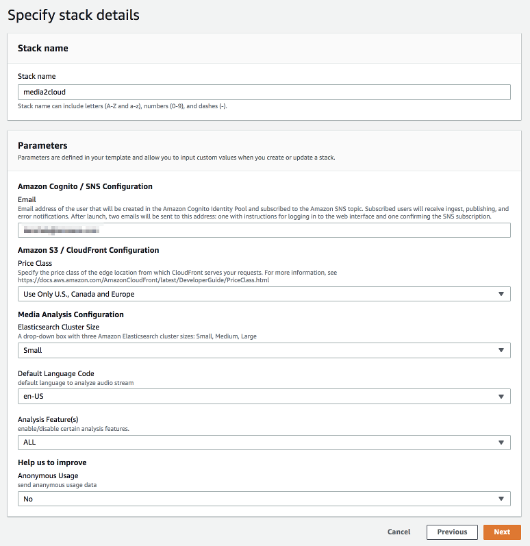
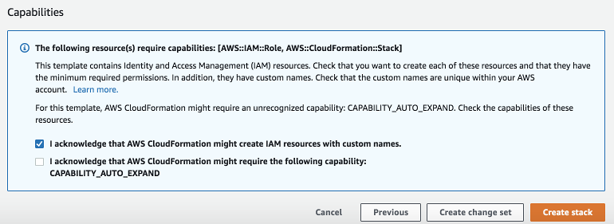

## 1. Creating your first Media2Cloud instance

This tutorial walks you through the steps to create your first Media2Cloud solution on AWS with AWS CloudFormation service. If you are not familiar with AWS CloudFormation service, [click here](https://aws.amazon.com/cloudformation/) to learn more.

----

#### Step 1: Launch CloudFormation stack

Click *Next* to continue

--

### Step 2: Specify stack details

| Name | Description |
|:---  |:------------|
| Stack name | any valid name |
| Email address | to receive log in information to Media2Cloud web portal. The email address is also suscribed to Amazon SNS service to receive notification from ingest, analysis, and labeling workflows |

--

### Step 3: Configure stack options
Leave it as is and click *Next*

--

### Step 4: Review
Make sure at least _"I acknowledge that AWS CloudFormation might create IAM resources with custom names."_ checkbox under Capabilities section is **CHECKED**!

Click *Create stack*

--

### Step 5: Wait for a Welcome email
The solution takes about 20 minutes to complete. When the stack is created, you should receive an email from _no-reply@verificationemail.com_ which contains the URL and sign in information to your Media2Cloud instance.

--

### Step 6: Log on to Media2Cloud web portal
Click on the URL link in the Welcome email and sign in with the credential provided in the email. The first time you sign in to the web portal, you will be prompted to change your password.

Now, you can start upload images and videos.

----

[Next tutorial](./2-restful-api.md) shows you how you can use RESTful APIs to drive Media2Cloud.
