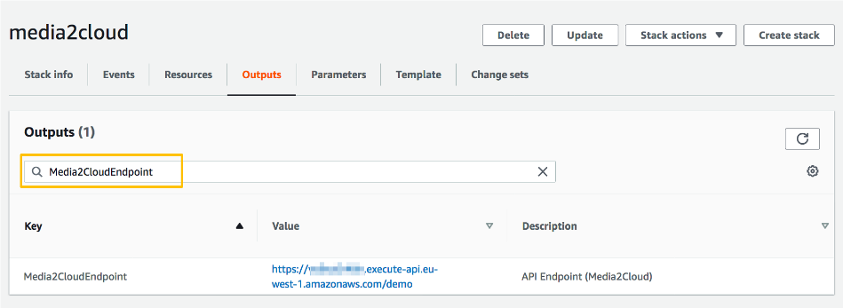
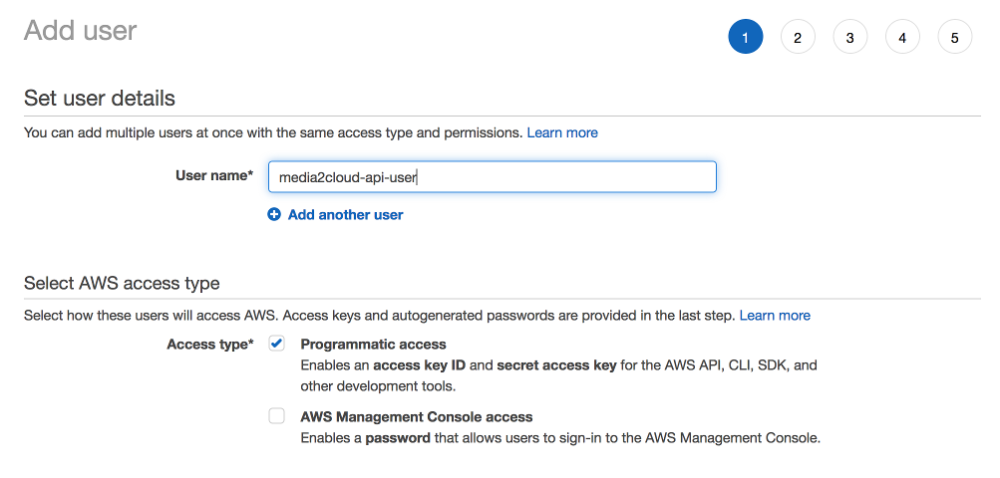
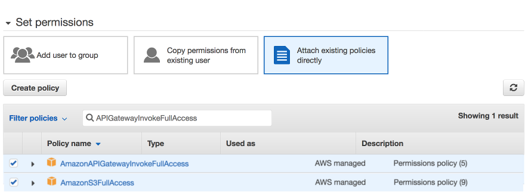
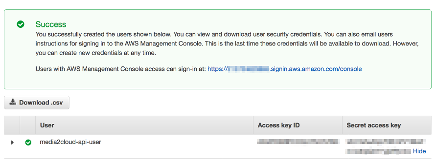
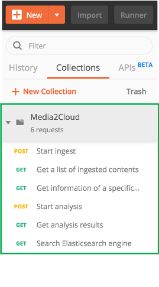

## 2. Using Media2Cloud RESTful API

Now that you should have created your Media2Cloud solution on your AWS account and are able to upload images and videos using the web user interface.

This tutorial shows you how you can use the RESTful API exposed by Media2Cloud solution to programmatically drive different workflows without using its web portal.

This is useful if you would like to integrate and automate Media2Cloud solution into your environment. To do that, we will need the followings:
1. Media2Cloud RESTful API endpoint to send HTTP requests
2. IAM user (or role) used to configure authenticated requests to send to Amazon API Gateway
3. Postman, an handy utility to send HTTP requests


So, let's start.

----

### Step 1: Locate your Media2Cloud RESTful API endpoint
Under AWS Management conole, go to **CloudFormation service**. Find the _Media2Cloud_ stack you just created earlier. Click on the _Outputs_ tab and search *Media2CloudEndpoint*, you should find your RESTful API endpoint,
```
https://<api-id>.execute-api.<aws-region>.amazonaws.com/demo
```



--

### Step 2: Create an IAM user (or role) with API Gateway permission

Media2Cloud RESTful API endpoint requires AWS_IAM authentication; therefore, we would need to create an IAM user with _execute:invoke_ permission to call the APIs. We have two options to create an IAM user: one that uses AWS CLI and one that uses AWS Management Console.

#### Option 1 - Using AWS CLI to create an IAM user
1. Make sure to install [AWS CLI](https://docs.aws.amazon.com/cli/latest/userguide/cli-chap-install.html) and configure the profile, see details [here](https://docs.aws.amazon.com/cli/latest/userguide/cli-chap-configure.html)

2. Create a user

```
aws iam create-user --user media2cloud-api-user
```

3. Attach **AmazonAPIGatewayInvokeFullAccess** and **AmazonS3FullAccess** policies to the user

```
aws iam attach-user-policy \
--policy-arn arn:aws:iam::aws:policy/AmazonAPIGatewayInvokeFullAccess \
--user media2cloud-api-user

aws iam attach-user-policy \
--policy-arn arn:aws:iam::aws:policy/AmazonS3FullAccess \
--user media2cloud-api-user
```


4. Create access key

```
aws iam create-access-key --user media2cloud-api-user
```
5. The command above returns the following response. Save the **AccessKeyId** and **SecretAccessKey** somewhere. We will need it to configure Postman later.

```
{
  "AccessKey": {
    "UserName": "media2cloud-api-user",
    "AccessKeyId": "<access-key-id>",
    "Status": "Active",
    "SecretAccessKey": "<secret-access-key>",
    "CreateDate": "2019-11-15T09:26:56Z"
  }
}
```

**IMPORTANT NOTE:** For simplicity, this tutorial uses **AmazonAPIGatewayInvokeFullAccess** and **AmazonS3FullAccess** policies. For production or staging environment, we highly recommend you to limit the policy to the least privilege access. For example, you can create a policy to allow the api user to only being able to invoke Media2Cloud RESTful API endpoints and access to specific bucket(s) but provide **no permission** to other resources.

```
{
  "Version": "2012-10-17",
  "Statement": [
    {
      "Effect": "Allow",
      "Principal": {
        "AWS": "arn:aws:iam::<account>:user/media2cloud-api-user"
      },
      "Action": [
        "execute-api:Invoke"
      ],
      "Resource": [
        "arn:aws:execute-api:<region>:<account-id>:<api-id>/<stage>/OPTIONS/*",
        "arn:aws:execute-api:<region>:<account-id>:<api-id>/<stage>/GET/*",
        "arn:aws:execute-api:<region>:<account-id>:<api-id>/<stage>/POST/*",
        "arn:aws:execute-api:<region>:<account-id>:<api-id>/<stage>/DELETE/*"
      ]
    },
    {
      "Effect": "Allow",
      "Principal": {
        "AWS": "arn:aws:iam::<account>:user/media2cloud-api-user"
      },
      "Action": [
        "s3:GetObject",
        "s3:PutObject"
      ],
      "Resource": [
        "arn:aws:s3:::<ingest-bucket-name>/*"
      ]
    }
  ]
}
```

#### Option 2 - Using AWS Management Console to create an IAM user
1. Go to **IAM service**
2. Click on **Users**
3. Click on **Add user**, specify **User name**. Under **Access type**, make sure **Programmatic access** is _CHECKED_. Click Next to continue.

4. Under **Set permission**, select **Attach existing policies directly**. Search for **AmazonAPIGatewayInvokeFullAccess** and **AmazonS3FullAccess** and attach both policies. Click Next to continue.

5. Under Add Tag page, Click Next to continue
6. Under Review page, Click **Create user**
7. You just created an IAM user to user Media2Cloud RESTful APIs. Make sure you download the csv file of your API user. We will need it to configure Postman in the next section.


--

### Step 3: Install and configure Postman
For this tutorial, we will use Postman application to send requests. If you have not installed it, [download](https://www.getpostman.com/apps) and install it.


#### Step 3.1: Import the Media2Cloud Postman collection template
For simplity, we created a Postman collection template (JSON document) to help you to configure the authentication and Media2Cloud RESTful API endpoints.

1. Download the collection template [here](./samples/media2cloud-api-postman-collection.json)

2. Open the collection template with your text editor. You should find **\<access-key-id\>**, **\<secret-access-key\>**, and **\<aws-region\>** under **auth** block as follows:

```
	"auth": {
		"type": "awsv4",
		"awsv4": [
			{
				"key": "sessionToken",
				"value": "",
				"type": "string"
			},
			{
				"key": "secretKey",
				"value": "<secret-access-key>",
				"type": "string"
			},
			{
				"key": "accessKey",
				"value": "<access-key-id>",
				"type": "string"
			},
			{
				"key": "region",
				"value": "<aws-region>",
				"type": "string"
			},
			{
				"key": "service",
				"value": "execute-api",
				"type": "string"
			}
		]
	},
```

3. Replace **\<access-key-id\>** and **\<secret-access-key\>** with the actual **Access Key Id** and **Secret Access Key** you obtained in [Step 2: Create an IAM user](./2-restful-api.md#step-2-create-an-iam-user-or-role-with-api-gateway-permission).

4. Replace **\<aws-region\>** to the actual AWS region where you create the Media2Cloud stack. AWS Region should is something like **us-east-1**, **us-west-2**, **eu-west-1**, and etc.

5. Find **\<Media2CloudEndpoint\>** and replace all **six** appearances to the actual Media2CloudEndpoint you obtain in [Step 1: Locate your Media2Cloud RESTful API endpoint](./2-restful-api.md#step-1-locate-your-media2cloud-restful-api-endpoint)

5. After you make the change, save the template.

6. Open Postman application, click on **Import** button, and import the template


7. After the import, you should see **Media2Cloud** collection being imported and under the Media2Cloud collection, you should find the following HTTP requests created.



--

### Step 4: Start to ingest content to Media2Cloud
To start the ingest, we assume that your video file is already **uploaded** to the ingest S3 bucket.

| Field | Value |
|:---  |:------------|
| Method | POST |
| URL | https://**\<Media2CloudEndpoint\>**/assets |
| Body | JSON document contains **bucket** and **key** |

Click on **Start ingest** request from the Media2Cloud collection menu.

Click on **Body** to change the JSON body to use the the actual ingest bucket name and object key.
```
{
	"bucket": "<ingest-bucket-name>",
	"key": "<object-key>"
}

```
where

**\<ingest-bucket-name\>** you can find it from AWS CloudFormation console:
* Go to **AWS CloudFormation console** and select the **Media2Cloud** stack you created
* Click on **Outputs** tab and search for **IngestBucket**

**\<object-key\>** is the location of the file resided in your ingest bucket


Click **Send**

If the request is succeeded, you should see the following response:
```
{
  "uuid": "<uuid>",
  "status": "STARTED",
  "executionArn": "arn:aws:states:<region>:<account-id>:execution:<ingest-state-machine>:<execution-id>",
  "startDate": "2019-10-20T19:28:58.014Z"
}
```
where

| Key | Value |
|:---  |:------------|
| uuid | unique identifier of the file. It is used for the rest of the processes.  |
| status | STARTED, indicated the ingest process has started |
| executionArn | an arn of the state machine. You can use the arn to monitor the ingest process |
| startDate | start date/time |

(Tips: Open Media2Cloud web interface to see if the file is processing.)

--

### Step 5: Get a list of files ingested in Media2Cloud
To get a list of files, click on **Get a list of ingested content** request from the Media2Cloud collection menu.

| Field | Value |
|:---  |:------------|
| Method | GET |
| URL | https://**\<Media2CloudEndpoint\>**/assets |
| Body | -- |

Click on **Send**

The response returns a list of uuids that represent the file set in Media2Cloud.
```
{
  "Items": [
    {
      "uuid": "<uuid-1>",
      "schemaVersion": 1,
      "type": "image",
      "timestamp": 1234
    },
    {
      "uuid": "<uuid-2>",
      "schemaVersion": 1,
      "type": "image",
      "timestamp": 1234
    },
    ...
  ]
}
```

where

| Key | Value |
|:---  |:------------|
| uuid | the unique identifier of a file. |
| schemaVersion | schema version of the JSON document |
| type | image, video, or audio |
| timestamp | timestamp of file ingested to Media2Cloud |

--

### Step 6: Get detail information of a specific file
To get the detail of a specifc ingested content, click on **Get information of a specific ingested content** from the Media2Cloud collection menu.


| Field | Value |
|:---  |:------------|
| Method | GET |
| URL | https://**\<Media2CloudEndpoint\>**/assets/**\<uuid\>** |
| Body | -- |

Replace **\<uuid\>** with the actual **uuid** of the file.

The response returns a JSON document contains detail information of the file.
```
{
    "schemaVersion": 1,
    "lastModified": 123,
    "timestamp": 123,
    "basename": "filena",
    "storageClass": "STANDARD",
    "fileSize": 43263,
    "imageinfo": {
      ...
    },
    "mime": "image/jpeg",
    "uuid": "<uuid>",
    "key": "andy-jassy/andy-jassy.jpg",
    "proxies": [
        {
            "storageClass": "STANDARD",
            "fileSize": 196217,
            "mime": "image/jpeg",
            "outputType": "proxy",
            "lastModified": 123,
            "type": "image",
            "key": "<uuid>/andy-jassy/image/proxy/andy-jassy.jpg"
        },
        ...
    ],
    "type": "image",
    "md5": "<md5>"
}
```

where

| Key | Value |
|:---  |:------------|
| uuid | the unique identifier of a file. |
| schemaVersion | schema version of the JSON document |
| key | key location of the file |
| basename | file basename |
| md5 | md5 checksum of the file |
| type | image, video, or audio |
| mime | mime type |
| fileSize | file size |
| storageClass | s3 storage class |
| timestamp | timestamp of file ingested to Media2Cloud |
| lastModified | last modified timestamp |
| imageinfo | EXIF information of the file (if is an image) |
| mediainfo | media information of the file (if video or audio) |
| proxies | a list of proxies created by Media2Cloud |

--

### Step 7: Start analyzing content
To start analysis process, click on **Start analysis** request from the Media2Cloud collection menu.

| Field | Value |
|:---  |:------------|
| Method | POST |
| URL | https://**\<Media2CloudEndpoint\>**/analysis |
| Body | JSON document contains **uuid** |

Replace **\<uuid\>** with the **uuid** from [Step 4](./2-restful-api.md#step-4-start-to-ingest-content-to-media2cloud)

```
{
	"uuid": "<uuid>"
}
```


Click **Send**

If the request is succeeded, you should see a response as follows:
```
{
  "uuid": "<uuid>",
  "status": "STARTED",
  "executionArn": "arn:aws:states:<region>:<account-id>:execution:<analysis-state-machine>:<execution-id>",
  "startDate": "2019-10-20T19:28:58.014Z"
}
```
where

| Field | Value |
|:---  |:------------|
| uuid | unique identifier of the file. It is used for the rest of the processes.  |
| status | STARTED, indicated the ingest process has started |
| executionArn | an Arn of the state machine. You can use the arn to monitor the analysis process |
| startDate | start date/time |

(Tips: Open Media2Cloud web portal and check if the analysis process of the file is started.)

--

### Step 8: Get analysis information of a specific file
To get the analysis results of a file, click on **Get analysis results** from the Media2Cloud collection menu.

| Field | Value |
|:---  |:------------|
| Method | GET |
| URL | https://**\<Media2CloudEndpoint\>**/analysis/\<uuid\> |
| Body | -- |

Replace **\<uuid\>** with the actual **uuid** of the file

The response returns a JSON document contain a list of detections.
```
[
  {
    "uuid": "<uuid>",
    "type": "video",
    "arn": "<execution-id>",
    "startTime": 123,
    "endTime": 123,
    "status": "COMPLETED",
    "rekognition": {
      "celeb": {
        "output": "<uuid>/demo-01/analysis/raw/20191020T200959/rekognition/celeb/output.json",
        "startTime": 123,
        "metadata": "<uuid>/demo-01/analysis/metadata/celeb",
        "id": "<rekognition-job-id>",
        "endTime": 123,
        "vtt": "<uuid>/demo-01/analysis/vtt/celeb",
        "trackBasenames": {
          "metadata": [],
          "vtt": [],
        }
      },
      ...
    }
  },
  {
    "uuid": "<uuid>",
    "type": "audio",
    "arn": "<execution-id>",
    "startTime": 123,
    "endTime": 123,
    "status": "COMPLETED",
    "comprehend": {
      "keyphrase": {
        "output": "<uuid>/demo-01/analysis/raw/20191020T200959/comprehend/keyphrase/output.json",
        "startTime": 123,
        "metadata": "<uuid>/demo-01/analysis/metadata/keyphrase/output.json",
        "endTime": 123,
        "trackBasenames": {}
      },
      ...
    },
    "transcribe": {
      "name": "<uuid>_8b9c3e3a84bb4927",
      "output": "<uuid>/demo-01/analysis/raw/20191020T200959/transcribe/output.txt",
      "startTime": 123,
      "endTime": 123,
      "vtt": "<uuid>/demo-01/analysis/vtt/transcribe/output.vtt"
    }
  }
]
```

where

| Key | Value |
|:---  |:------------|
| uuid | the unique identifier of a file. |
| type | type of the detection |
| arn | execution arn of the state machine |
| startTime | start time of the analysis process |
| endTime | end time of the analysis process |
| status | status of the analysis process |
| rekognition | rekognition of detection |
| rekognition.celeb | celeb detection |
| rekognition.celeb.output | location of the celeb detection results |
| rekognition.celeb.id | Rekognition job id |
| rekognition.celeb.startTime | start time of celeb detection |
| rekognition.celeb.endTime | end time of celeb detection |
| rekognition.celeb.metadata | key prefix of metadata tracks |
| rekognition.celeb.vtt | key prefix of vtt tracks |
| rekognition.celeb.trackBasenames | tracks generated by M2C |
| rekognition.celeb.trackBasenames.metadata | a list of webvtt tracks generated by M2C |
| rekognition.celeb.trackBasenames.vtt | a list of vtt tracks generated by M2C |
| comprehend | comprehend detection |
| comprehend.keyphrase | comprehend key phrase detection |
| comprehend.keyphrase.output | location of the raw keyphrase detection results |
| comprehend.keyphrase.metadata | metadata track created by M2C |
| comprehend.keyphrase.startTime | start time of keyphrase detection |
| comprehend.keyphrase.endTime | end time of keyphrase detection |

--

### Step 9: Search content
To search content from Amazon Elasticsearch engine, click on **Search Elasticsearch engine** from the Media2Cloud collection menu.

| Field | Value |
|:---  |:------------|
| Method | GET |
| URL | https://**\<Media2CloudEndpoint\>**/search?query=**\<search-term\>** |
| Body | -- |

Replace **\<search-term\>** with the actual search teram; i.e, **john**

The response returns a JSON document contain a list of search results.

```
{
  "uuids": [
    "<uuid-1>",
    "<uuid-2>"
  ],
  "token": 2,
  "total": 10
}
```

where

| Key | Value |
|:---  |:------------|
| uuids | a list of content uuids matches the search term |
| token | a token indicating the current pagination position of search result list. You can use it to page the next results by add it to the query string. For example, <br>_https://\<Media2CloudEndpoint\>/search?query=\<search-term\>&**token=2**_ |
| total | total number of items that matches the search term |

----

Now then you have learned the basic RESTful APIs exposed by Media2Cloud. In the next tutorial, we will use the APIs to automate the ingest process when a file is uploaded to S3 bucket.

Click [Next](./3-s3-event-trigger.md) to continue.
