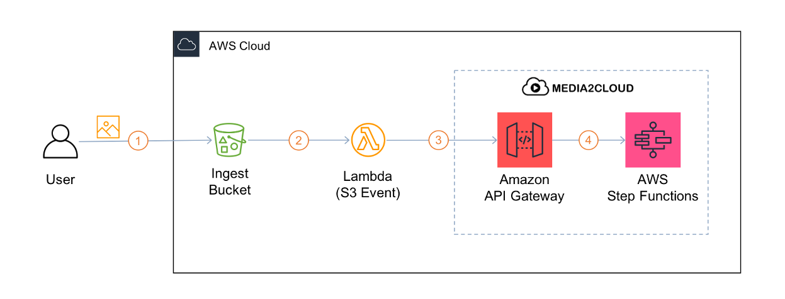
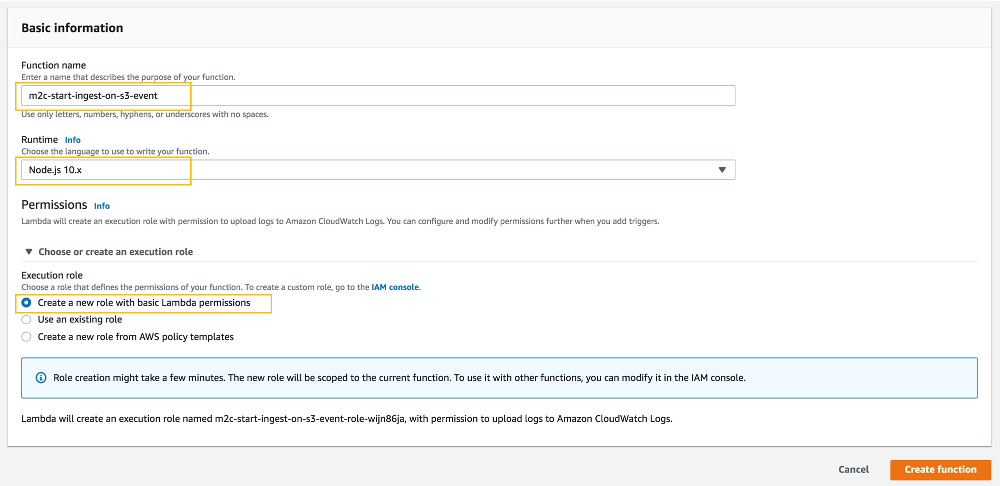
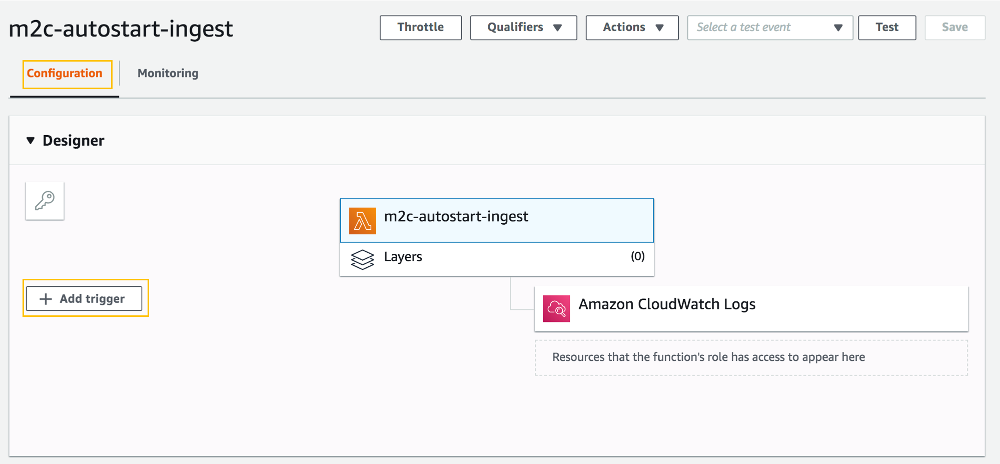
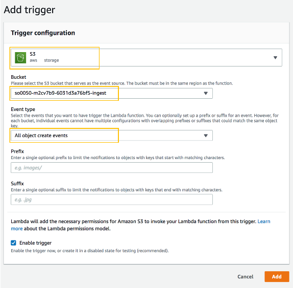
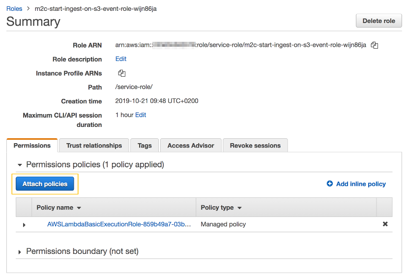
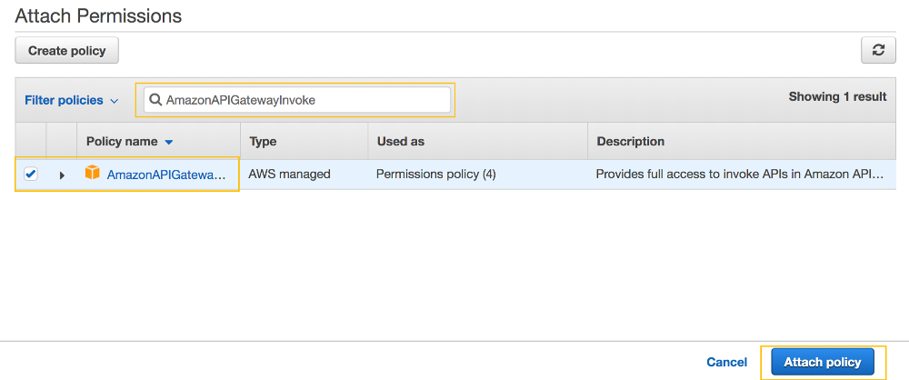
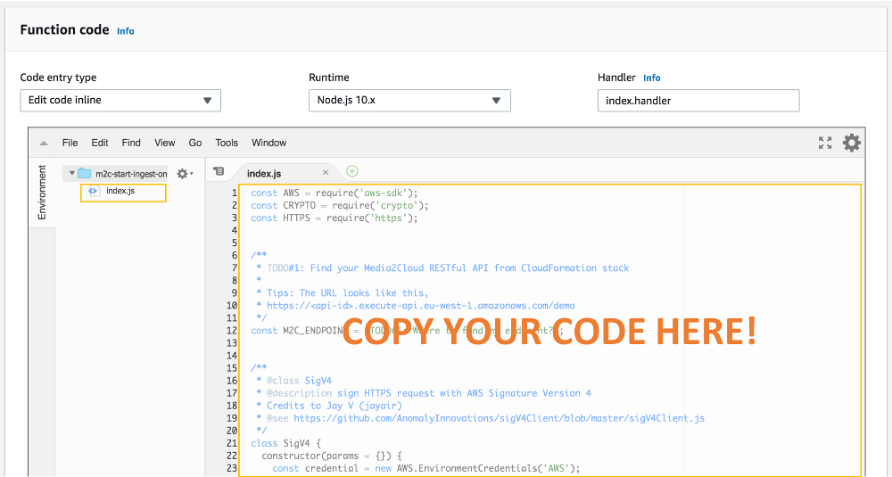
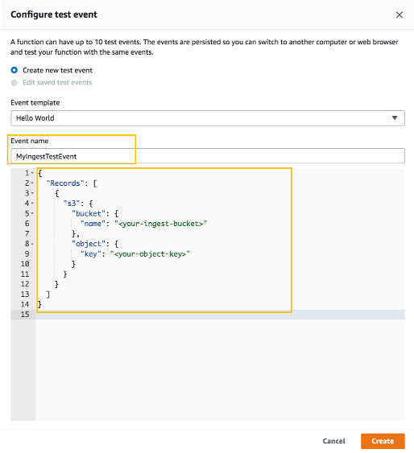

## 3. Using Amazon S3 event to auto trigger ingest process

To take advantage of the RESTful APIs from Media2Cloud, this tutorial shows you how you can use _Amazon S3 Event  Notification_ to auto-start ingest process whenever a video (or an image) is uploaded to your S3 bucket. The diagram illustrates the workflow we will build.



1. Upload an image or video to the ingest bucket. You could use S3 console or [AWS CLI](https://docs.aws.amazon.com/cli/latest/userguide/cli-chap-install.html) commandline tool. To learn more about Amazon S3 Event Notification, see [Configuring Amazon S3 Event Notifications](https://docs.aws.amazon.com/AmazonS3/latest/dev/NotificationHowTo.html)
```
# make sure you have Access Key, Secret Access, and/or Session Token
# set in your environment variables or use AWS profile.
aws s3 cp some-video.mp4 s3://<ingest-bucket-name>/demo/ [--proile <your-profile>]
```
where **\<ingest-bucket-name\>** you can find it from AWS CloudFormation console:
  * Go to **AWS CloudFormation console**, select the **Media2Cloud** stack you created
  * Click on **Outputs** tab and search for **IngestBucket**
2. When the file landed in the S3 bucket, S3 sends a s3:ObjectCreated:* notification where we will configure a lambda function to subscribe to that notification and to process the event.
3. The lambda function parses the notification event and calls Media2Cloud RESTful APIs to ingest the file.
4. The ingest API (POST /assets) invokes the ingest process by starting a state machine.

So, to get this to work, we will:
* create a lambda function
* create a new IAM role with permission to invoke APIs
* add trigger to let Amazon S3 to invoke our lambda function
* test it out
----

### Step 1: Create a lambda function
In AWS Management Console, go to **AWS Lambda** service. Click on **Create function** button.
Under Create function page, choose **Author from scratch** and fill in the following information.

| Field | Value |
|:---  |:------------|
| Function name | any valid funciton name will work, ie., m2c-start-ingest-on-s3-event |
| Runtime | For this exercise, we use NodeJS 10.x. |
| Execution role | choose _Create a new role with lambda Lambda permissions_. Later on, we will modify the permission to allow the lambda to invoke APIs |



Click _Create function_ to continue.

--

### Step 2: Add trigger to S3 ingest bucket
Once the lambda function is created, you should see the lambda configuration  page.



Click on **Add trigger** button and configure the trigger to point to your **ingest bucket**.

| Field | Value |
|:---  |:------------|
| Select a trigger | Select **Amazon S3** |
| Bucket | Select the **ingest bucket** created by Media2Cloud. The naming convention is **so0050-\<stack-name\>-\<guid\>-ingest** |
| Event type | All object create events |
| Prefix | Leave it blank for the exercise. Technically, you would like to avoid your function being triggered for every file. Use the _Prefix_ to limit the scope. For example, set it to **demo/** so you function will only get triggered if a file is uploaded to **demo/** folder |
| Suffix | Leave it blank for the exercise. Again, you should use **Suffix** to limit the scope by providing the file extension; for instance, **.mp4** or **.jpg** and so forth. |



Click on _Add_.

We just wired our lambda function to our S3 bucket. Now that when you upload any file to the **ingest bucket**, this lambda function will get called! Next, we will modify the permission to allow our lambda function to call Media2Cloud RESTful APIs.

--

### Step 3: Add API permission to lambda
Go back to the lambda configuration page, scroll down until you see **Execution role** section. Click on **View m2c-start-ingest-on-s3-event-role-blah-blah role** on the IAM console (note that your role name will be different). 


This should bring you to **Identity and Access Management (IAM)** service. Click on **Attach policies**



Under Attach Permissions page, search **AmazonAPIGatewayInvokeFullAccess**, check the checkbox, and **Attach policy**.



--

### Step 4: Adjust Lambda Function Timeout setting
Go back to the lambda configuration page to adjust the timeout setting. By default, the lambda function is configured to timeout in 3 seconds. So, let's change it to 1 minute to allow enough time for the execution. (note that even if you set it to 15 minutes, you still get charged for the **actual** execution time.)

Optionally you can increase the **Memory (MB)** but for our exercise, 128 MB is more than enough.


--
### Step 5: Add code to start ingest workflow
Finally, time to add our logic to start ingest process when we receive a S3 event.

* Download the sample code from [here](./samples/start-media2cloud-workflows.js)
* Open your text editor.

**FIVE** places you need to take care of! Look for:
Search for , you should see
* **TODO#1** where you need to replace the **Media2Cloud Endpoint URL**
```
  /**
    * TODO#1: Find your Media2Cloud RESTful API from CloudFormation stack
    * Tips: Review Tutorial #2, Using Media2Cloud RESTful API
    */
  function getMedia2CloudEndpoint() {
    return '#YOUR_MEDIA2CLOUD_API_ENDPOINT';
  }
```
* **TODO#2** where you need to parse the S3 event object to find out the bucket name
```
  /**
    * TODO#2: Parse the bucket name from S3 Event payload
    * Tips: https://docs.aws.amazon.com/AmazonS3/latest/dev/notification-content-structure.html 
    */
  function getBucketNameFromS3Event(event) {
    return '#deconstruct S3 Event JSON object to return bucket name';
  }
```
* **TODO#3** where you need to parse the S3 event object to find out the object key
```
  /**
    * TODO#3: Parse the object key from S3 Event payload
    * Tips: https://docs.aws.amazon.com/AmazonS3/latest/dev/notification-content-structure.html 
    */
  function getObjectKeyFromS3Event(event) {
    return '#deconstruct S3 Event JSON object to return the object key';
  }
```
* **TODO#4** where you need to specify the HTTP **method** to start ingest process
```
  /**
    * TODO#4: What should the HTTP method be for starting ingest process?
    * Tips: Review Tutorial #2, Using Media2Cloud RESTful API
    */
  function getIngestHttpMethod() {
    return '#HTTP_METHOD';
  }
```
* **TODO#5** where you need to specify the HTTP **path** to start ingest process.
```
  /**
    * TODO#5: What is the path for starting ingest process?
    * Tips: Review Tutorial #2, Using Media2Cloud RESTful API. Do not include '/demo'
    */
  function getIngestHttpPath() {
    return '#INGEST_PATH';
  }
```

* Once you are done, copy and paste to the lambda console embedded IDE

* Click **Save**

If you are not familiar with NodeJS syntax, scroll to the bottom of the page to find the answers.

--

### Step 6: Test the lambda function
Create a test event by clicking on **Select a test event** menu and select **Cofigure test events**.


Copy and paste the following JSON event to the code area. Also, name your test event; ie. MyIngestTestEvent. Then, save it.

```
{
  "Records": [
    {
      "s3": {
        "bucket": {
          "name": "<ingest-bucket-name>"
        },
        "object": {
          "key": "<object-key>"
        }
      }
    }
  ]
}
```



Click **Test**

Observe the **Execution result:**

--

### Step 7: Upload an image or video
Let's put your logic in test.

* Open Amazon S3 Console and find your ingest bucket.
* Click **Upload** button
* Drag and drop an image (or video) to it. Click **Upload**
* Observe your Media2Cloud web portal. You should see a file started.

----

### Answers:
#### TODO #1
```
function getMedia2CloudEndpoint() {
  return 'https://<api-id>.execute-api.eu-west-1.amazonaws.com/demo';
}
```

#### TODO #2
```
function getBucketNameFromS3Event(event) {
  return event.Records[0].s3.bucket.name;
}
```

#### TODO #3
```
function getObjectKeyFromS3Event(event) {
  return event.Records[0].s3.object.key;
}
```

#### TODO #4
```
function getIngestHttpMethod() {
  return 'POST';
}
```

#### TODO #5
```
function getIngestHttpPath() {
  return '/assets';
}
```

----

You have created an auto-ingest workflow. When someone uploads a file to your bucket, your lambda function gets called to process the request by sending the request to Media2Cloud RESTful API to start the ingest process.

In the [Next tutorial](./4-sns-notification.md), let us expand the automation to also auto-run AI/ML analysis process.
